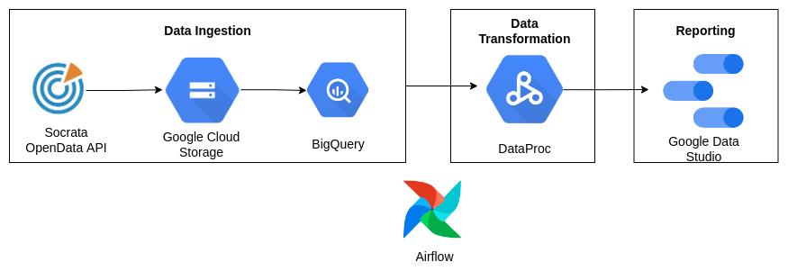
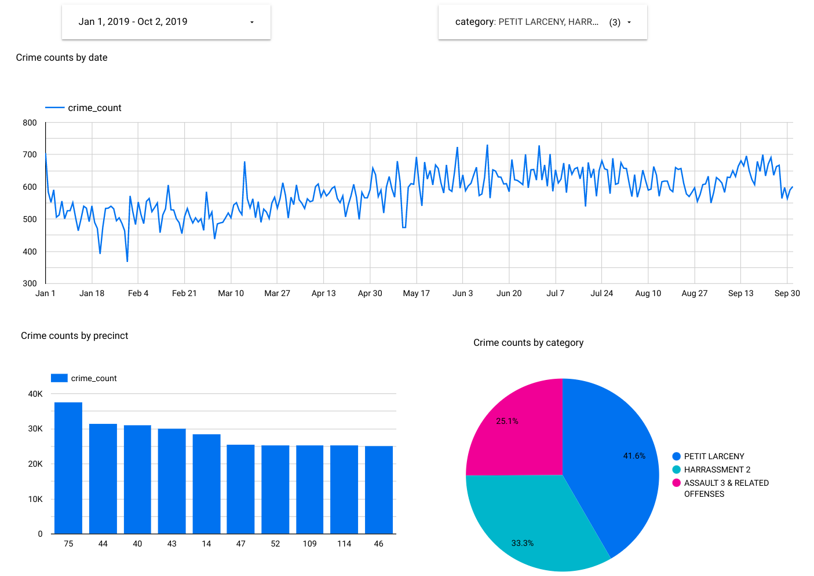

# Crime Analytics (New York City) - Data Engineering Project
This repo contains the final project implemented for the [Data Engineering zoomcamp](https://github.com/DataTalksClub/data-engineering-zoomcamp) course.

## Introduction

Crimes are a major contributor to social and economic unrest in metropolitan areas. This project aims to develop a workflow to ingest and process urban crime data, specifically for New York city, for downstream analysis.

## Dataset
The [NYPD Complaint Data Historic](https://data.cityofnewyork.us/Public-Safety/NYC-crime/qb7u-rbmr) dataset is used. It can be obtained conveniently through the [Socrata API](https://dev.socrata.com/foundry/data.cityofnewyork.us/qb7u-rbmr). This dataset is updated at a quarterly interval.

Each row denotes a crime occurrence. Details include information about the time, location and descriptive categorizations of the crime events. 

## Tools

The following components were utilized to implement the required solution:
* Data Ingestion: [Socrata API](https://dev.socrata.com/foundry/data.cityofnewyork.us/qb7u-rbmr) (used via the [sodapy](https://pypi.org/project/sodapy/) python client).
* Infrastructure as Code: Terraform
* Workflow Management: Airflow
* Data Lake: Google Cloud Storage
* Data Warehouse: Google BigQuery
* Data Transformation: Spark via Google Dataproc
* Reporting: Google Data Studio

### Architecture


## Steps to Reproduce

### Local setup
* Install the below tools:
  * [Terraform](https://www.terraform.io/downloads)
  * [Google Cloud SDK](https://cloud.google.com/sdk/docs/install-sdk#deb)
  * docker + docker-compose v2

### Cloud setup
* In GCP, create a service principal with the following permissions:
  * BigQuery Admin
  * Storage Admin
  * Storage Object Admin
  * Dataproc Admin
* Download the service principal authentication file and save it as `$HOME/.google/credentials/google_credentials_project.json`.

* Ensure that the following APIs are enabled:
  * Compute Engine API
  * Cloud Dataproc API
  * Cloud Dataproc Control API
  * BigQuery API
  * Bigquery Storage API
  * Identity and Access Management (IAM) API
  * IAM Service Account Credentials API

### Initializing Infrastructure (Terraform)

* Perform the following to set up the required cloud infrastructure
```shell
cd terraform
terraform init
terraform plan
terraform apply

cd ..
```

### Data Ingestion

* Setup airflow to perform data ingestion
```shell
cd airflow

docker-compose build
docker-compose up airflow-init
docker-compose up -d
```

* Go to the aiflow UI at the web address `localhost:8080` and enable the `data_crime_ingestion_dag`. 
* This dag will ingest the crime data entries reported after 2015, upload it to the data lake and ingest it to the data warehouse.

### Data Transformation
* Enable and run the `data_crime_process_dag`
* This will create a Dataproc cluster and submit a spark job to do perform the required transformations on the data.
* The transformed data will be saved as a Bigquery table


## Dashboard



It can also be viewed at this [link](https://datastudio.google.com/reporting/426e3d94-c051-4085-848f-fd61695d04fb).


